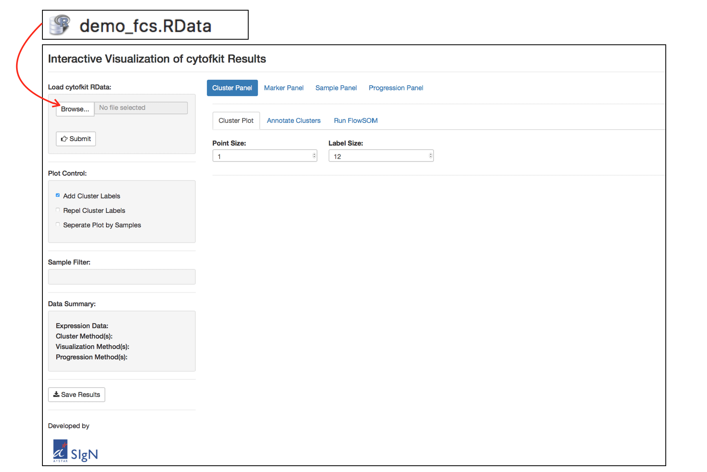
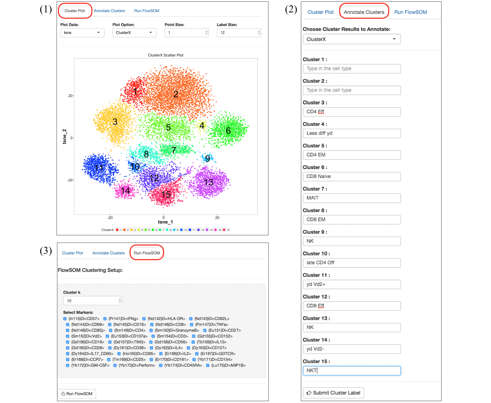
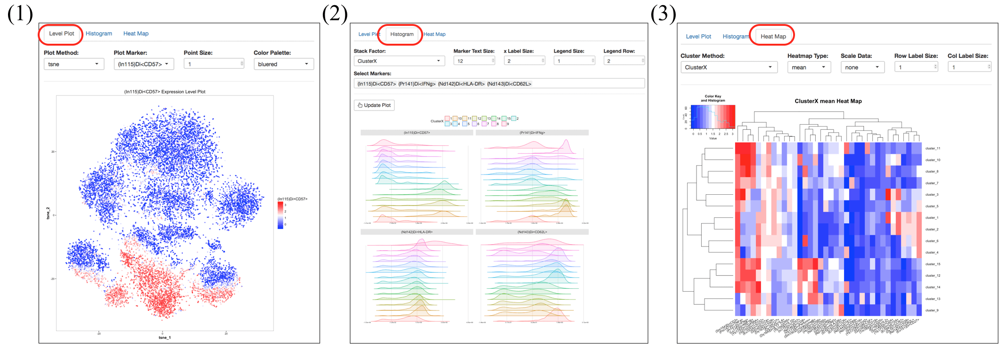
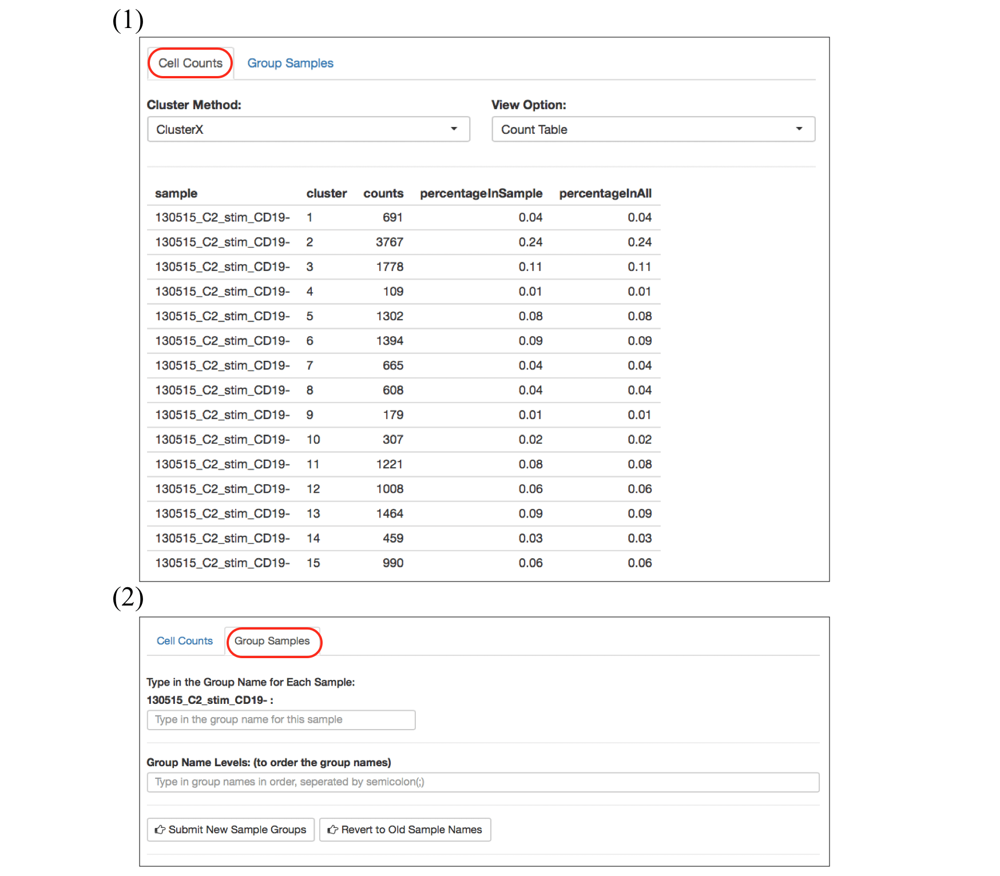

<!--
%% \VignetteEngine{knitr::rmarkdown}
%\VignetteIndexEntry{ShinyAPP tutorial}
-->


# Launch the Shiny APP

- cytofkit Shiny APP is integrated into the cytofkit pacakge, and can be deployed locally using the following command:
    ```{r, eval=FALSE}
    require(cytofkit)
    cytofkitShinyAPP()
    ```

- cytofkit Shiny APP is also hosted by shinyapps.io, and can be used through the public link: [cytofkitShinyAPP](https://cytofkit.shinyapps.io/shiny/) 

# Loading .RData to Shiny APP     

After the analysis was done using cytofkit, a special **RData file** will be saved with suffix of `.RData`. This **RData file** is saved for loading to the shiny APP to explore the results (The RData file used in this vignette can be found on the [github](https://github.com/JinmiaoChenLab/cytofkit_analysis_data_code) ). 



Click the top-left `Choose File` button to choose **RData file**, then click the `submit` button below to load the data.

For use on servers, the `Server File Select` button can be used to load data directly from server without storing it locally.

As shown in the figure above, there are one **side panel** and one **main panel** for the cytofkit shiny APP. 

- On the side panel, there are some global control widgets like loading the data, plot control, sample filter, a summary of the data and a button for saving the results.   
- On the main panel, functions are categorized into four subpanels: **Cluster Panel**, **Marker Panel**, **Sample Panel** and **Progression Panel**, which are explained below:

# Cluster Panel   

Inside the cluster panel, there are three tab panels, **Cluster Plot**, **Annotate Clusters** and **Run FlowSOM**. 



1. **Cluster Plot**: visualize the clusters on the scatter plot of dimensionality reduced data. Use `Plot Data` to choose the dimensionality reduced data, and `Plot Option` to choose clustering results. Point size and label size can be adjusted to fit your needs.

2. **Annotate Clusters**: clusters can be annotated with cell population names. Once submitted, an annotated clustering option will be added to `Plot Option`.

3. **Run FlowSOM**: if the clustering results doesn't make sense, another clustering option named FlowSOM can be tried. For FlowSOM, you need to specify the number of clusters. Once done, a FlowSOM clustering results will be added to `Plot Option`.

# Marker Panel

Marker Panel facilitates the annotation of clusters, it contains three tab panels: **Level Plot**, **Histogram** and **Heat Map**.



1. **Level Plot**: visualize the expression level of selected marker on dimensionality reduced data, like on t-SNE. In `Plot Marker`, you can also select all markers to visualize the expression level of all markers in one plot.

2. **Histogram**: check and compare the histogram of selected markers among different clusters or samples.

3. **Heat Map**: an overview of the expression profile of all clusters on all markers. 

# Sample Panel

Sample Panel allows checking the change of subset abundance among samples, as well as regrouping samples, it includes two tab panels: **Cell Counts** and **Group Samples**.



1. **Cell Counts**: check the cell counts in each cluster among each samples in a table, in a line plot or in a percentage heat map.

2. **Group Samples**: regroup the samples.

# Progression Panel

Progression Panel helps estimate the relationship among subsets, it's targeted to detect the subset progression path automatically through diffusion map or ISOMAP. It has three tab panels: **Subset Relationship Plot**, **Marker Expression Profile** and **Run Diffusion Map**.


1. **Subset Relationship Plot**: a scatter plot showing the estimated relationship of the clusters.

2. **Marker Expression Profile**: show the expression trend of selected markers along a selected ordering method with a regression line.

3. **Run Diffusion Map**: combine the diffusion map with the clustering results to infer inter-subset relatedness. Firstly, down-sampled the number of cells in each cluster to an equal size, thus reducing the cell subsets density heterogeneities and removing the dominance effect of large populations in the data. Then run diffusion map on the down-sampled dataset. 


