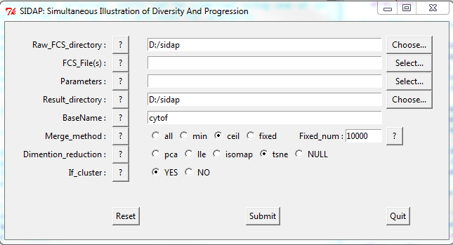
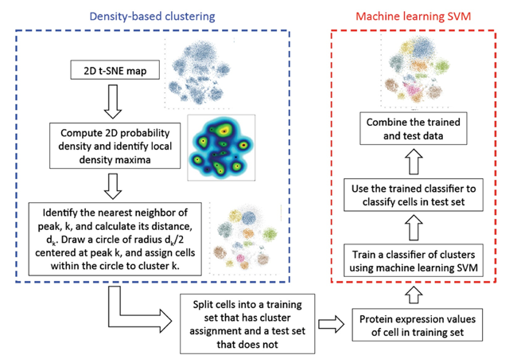

<!--
  %\VignetteIndexEntry{cytofkit: workflow of mass cytometry data analysis}
  %\VignetteEngine{knitr::knitr}
-->


cytofkit: workflow of mass cytometry data analysis
====================================================
             
             
Introduction
-----------------------

The **cytofkit** package is designed to facilitate the analysis of mass cytometry data with automatic subset identification and population boundary detection. It integrates dimension reduction (PCA, t-SNE or ISOMAP) with density-based clustering (DensVM) for rapid subset detection. Subset-clustering scatter plot and heat map will be generated for objective comparative analysis and statistical testing.
                   
                   
cytofkit quick start
--------------------------

### Run with GUI

**cytofkit** provides a user friendly GUI to use **cytofkit** package. It provides the options for customizing your own analysis.To launch the GUI, just type the command:
```{r}
require("cytofkit") 
# cytof_tsne_densvm_GUI()  ## remove the hash symbol to open the GUI
```

The interface will appear like this, you can click the help button `?` to check the information for each entry.


               
               
### Run on commands

**cytofkit** also provides a core function `cytof_tsne_densvm()` to facilitate the analysis pipeline of mass cytometry data. Users only need to define several key parameters to make their analysis automatically. One simple way of running cytofkit using the core function is like this:
```{r, eval=FALSE}
dir <- system.file('extdata',package='cytofkit')
file <- list.files(dir ,pattern='.fcs$', full=TRUE)
parameters <- list.files(dir, pattern='.txt$', full=TRUE)
# change "writeResluts" to TRUE for your analysis if you want to save the result files
cytof_tsne_densvm(fcsFile = file, paraFile = parameters, rawFCSdir = dir, baseName = 'test')   
```

You can also define more parameters to create your own analysis, please check the help page of `cytof_tsne_densvm()` to get more information of the parameters.
```{r, results='hide'}
?cytof_tsne_densvm
```
             
             
cytofkit Analysis results
--------------------------------

All the analysis results will be saved under your `resDir` (result directory), which was explained below:

+ __*baseName*\_lgcl\_merged\_markerFiltered\_exprsData.txt__
   It contains the expression data from FCS file(s) being logicle transformed by `lgclMethod`, merged by `mergeMethod`, and filtered with selected markers in `para` or `paraFile`.
   
+ __*baseName*\_tsne.pdf__
  scatter plot of the *tsne* transformed results (dimension reduction results).
                       
+ __*baseName*\_dimension\_transformed.txt__
  It contains the dimension reduced data by *tsne*.
                    
+ __*baseName*\_tsne\_cluster.txt__
  It contains the cluster results by *denSVM* on the tsne transformed data.
                         
+ __*baseName*\_NumOfpeaks\_Vs\_kernalBandwith.pdf__
  A line graph shows the number of peaks with increasing bandwidth(gamma)
                   
+ __*baseName*\_tsne\_cluster\_plot.pdf__
  A scatter plot of the cluster results, clusters are labelled in different colours, and samples are represented by different shapes.
                     
+ __*baseName*\_tsne\_cluster\_grid\_plot.pdf__
  A scatter plot of the cluster results for each FCS file, and combined in a grid plot (if more than one FCS input files are analysised)
                         
+ __*baseName*\_clusterMean.txt__
  It contains the mean expression value of each marker in each cluster. 
                  
+ __*baseName*\_clusterMeanHeatmap.pdf__
  A heat map shows the mean expression value of each marker in each cluster. 
                   
+ __*baseName*\_clusterCellCount.txt__
  It contains the number and percentage of cells in each cluster for each FCS file, 
                   
+ __*baseName*\_clusterPercHeatmap.pdf__
  A heat map shows the cluster percentage of cells for each FCS file.
                       
+ __*baseName*\_analyzedFCS__
  The dimension transformed data and cluster results are saved into each corresponding FCS fileS under this directory.
                        
                        
cytofkit analysis pipline
--------------------------------

### Pre-processing

.FCS files were imported via the *read.FCS* function in the *flowCore* package. Intensity values of marker expression were then logicle-transformed, and markers selected were extracted for downstream analysis. For multiple files, a parameter of fixedNum is provided to sample fixed number of cells from each fcs file for combined analysis. Check the function `fcs_lgcl_merge` for implementation of this step.

```{r, results='hide'}
?fcs_lgcl_merge
```


### Dimensionality reduction

t-Distributed Stochastic Neighbor Embedding (t-SNE)[1] is suggested for dimensionality reduction although we also provide methods like PCA and ISOMAP. Briefly, t-SNE converts pair-wise distances between every two data points into a conditional probability that they are potential neighbors. It initializes the embedding by putting the low-dimensional data points in random locations that are adjusted in iteration, aiming to optimize the match of the conditional probability distributions between high and low dimensional spaces. The optimization is done using a gradient descent method to minimize a cost function defined by Kullback-Leibler divergences. We utilized bh\_tsne with R package *Rtsne*, an efficient implementation of t-SNE via Barnes-Hut approximations[2]. Check the function `cytof_dimReduction` for implementation of this step.

```{r, results='hide'}
?cytof_dimReduction
```

  
### Cluster analysis using DensVM

We used Density-based clustering aided by support Vector Machine (DensVM) to automate subset detection from the t-SNE map (schematic of DensVM). By using DensVM, we are able to objectively assign every cell to an appropriate cluster. 



Check the function `densVM_cluster` for implementation of this step.

```{r, results='hide'}
?densVM_cluster
```


### Cluster annotation using scatter plot and heat map

In order to examine whether DensVM clusters represent biologically meaningful cell populations, we annotated individual clusters by using scatter plot(`cluster_plot` and `cluster_gridPlot`) and heat maps (`clust_mean_heatmap` and `clust_percentage_heatmap`). Scatter plot visualize the cell points with colour indicating their assigned clusters and point shape representing their belonging samples. Cell events are also grouped by clusters and mean intensity values per cluster for every marker is calculated (`clust_state`). Heat map visualizing the mean expression of every marker in every cluster is generated with no scaling on the row or column direction. Hierarchical clustering was generated using Euclidean distance and complete agglomeration method. We used the heat maps to interrogate marker expression to identify each cluster's defining markers.  

### Post-processing

The cluster results can be visualized with dimension transformed data from "tsne", "pca" and "isomap". The cluster coordinates, together with the t-SNE, PCA and ISOMAP coordinates, were added to the .FCS files as additional parameters and saved for post analysis, all intermediate files and the plots can be saved using the function `cytof_write_results`.

```{r, results='hide'}
?cytof_write_results

```

             
             
References
--------------

[1] L.J.P. van der Maaten and G.E. Hinton. Visualizing High-Dimensional Data Using t-SNE. Journal of Machine Learning Research 9(Nov):2579-2605, 2008.

[2] L.J.P. van der Maaten. Barnes-Hut-SNE. In Proceedings of the International Conference on Learning Representations, 2013.